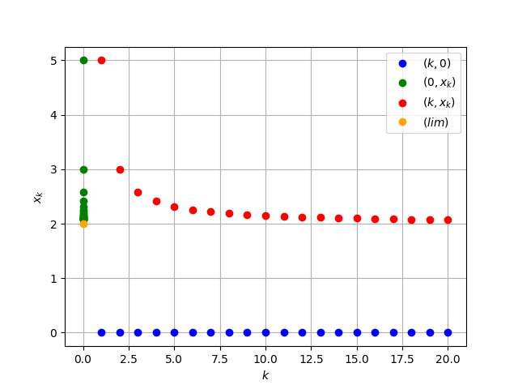

<h2 style="text-align: center;">Бюджетное учреждение высшего образования Ханты-Мансийского автономного округа – Югры</h2>

<h1 style="text-align: center;">«СУРГУТСКИЙ ГОСУДАРСТВЕННЫЙ УНИВЕРСИТЕТ»</h1>

<h2 style="text-align: center;">Политехнический институт</h2>

<p style="text-align: center;">Кафедра прикладной математики</p>

<p style="text-align: center;">Гркикян Мисак Эдикович</p>

<h1 style="text-align: center;">Числовые последовательности</h1>

<p style="text-align: center;">Дисциплина «Математический анализ»</p>

<p style="text-align: center;">направление 01.03.02 «Прикладная математика и информатика»</p>

<p style="text-align: center;">направленность (профиль): «Технологии программирования и анализ данных»</p>

<pre>

</pre>

<p style="text-align: right;">Преподаватель: Ряховский Алексей Васильевич  </p>

<p style="text-align: right;">Доцент</p>

<p style="text-align: right;">Студент гр. № 601-31</p>

<p style="text-align: right;">Гркикян Мисак Эдикович</p>

<pre>

</pre>

<p style="text-align: center;">Сургут 2023 г.</p>

<h3 style="text-align: center;">Лабораторная работа №1. Числовые последовательности.</h3>
<h3 style="text-align: center;">Вариант №7</h3>

#### Задание

Вычислить пределы данных числовых последовательностей двумя способами:

- аналитически
- используя библиотеки Python для символьных вычислений.

Для каждой числовой последовательности $\{x_k\}_{k=1}^\infty$ на одном рисунке построить (используя графические пакеты Python) следующие множества точек ($k = 1, \ldots, m$):

- (k, 0) – синий цвет
- (0, $x_k$) – зеленый цвет
- (k, $x_k$) – красный цвет

В случае, если последовательность сходится, построить на соответствующем рисунке точку (оранжевый цвет) изображающую предел последовательности $\{x_k\}_{k=1}^\infty$.

В задача 1 для сходящихся последовательностей, для заданного $\varepsilon>0$ найти такой номер $n(\varepsilon)$, начиная с которого $|x_k-A|<\varepsilon, \forall k\geq n(\varepsilon)$

#### Аналитическое решение 1

Рассмотрим предел:

$\lim\limits_{n\rightarrow\infty}\frac{\sqrt n + 7}{2 \sqrt n + 1}$

Найдем пределы числителя и знаменателя:

- $\lim\limits_{n\rightarrow\infty}(\sqrt n + 7)=\infty$
- $\lim\limits_{n\rightarrow\infty}(2 \sqrt n + 1)=\infty$

Поскольку выражение $\frac{\infty}{\infty}$ является неопределенностью, преобразуем его, деля каждое слагаемое в числителе и знаменателе на старшую степень, в данном случае это $\sqrt n$:

$\lim\limits_{n\rightarrow\infty}\frac{\sqrt n + 7}{2 \sqrt n + 1}$ = $\lim\limits_{n\rightarrow\infty} \frac{\frac{\sqrt n + 7}{\sqrt n}}{\frac{2 \sqrt n + 1}{\sqrt n}}$

Вычислим предел числителя и знаменателя, вычисляя предел каждого слагаемого:

- $\lim\limits_{n\rightarrow\infty} \frac{\frac{\sqrt n}{\sqrt n} + \frac{7}{\sqrt n}}{\frac{2 \sqrt n}{\sqrt n} + \frac{1}{\sqrt n}}$
- $\lim\limits_{n\rightarrow\infty} \frac{\sqrt n}{\sqrt n} = 1$
- $\lim\limits_{n\rightarrow\infty} \frac{7}{\sqrt n} = 0$
- $\lim\limits_{n\rightarrow\infty} \frac{2 \sqrt n}{\sqrt n} = 2$
- $\lim\limits_{n\rightarrow\infty} \frac{1}{\sqrt n} = 0$

Следовательно:
$\lim\limits_{n\rightarrow\infty}{\frac{\sqrt n}{\sqrt n} + \frac{7}{\sqrt n}} = 1$

Аналогично для знаменателя:
$\lim\limits_{n\rightarrow\infty}{\frac{2 \sqrt n}{\sqrt n} + \frac{1}{\sqrt n}} = 2$

Найдем предел:

$\lim\limits_{n\rightarrow\infty}(\frac{1}{2})=\frac{1}{2}$

Найдем номер n(ε):

$\lim\limits_{n\rightarrow\infty}\frac{\sqrt n + 7}{2 \sqrt n + 1}$ = $\frac{1}{2}$

|$\frac{\sqrt n + 7}{2 \sqrt n + 1}$ - $\frac{1}{2}$| = $|\frac{2(\sqrt{n} + 7) - (2\sqrt{n} + 1)}{4\sqrt{n} + 2}|$ = $|\frac{2\sqrt{n} + 14 - 2\sqrt{n} - 1}{4\sqrt{n} + 2}|$ = $|\frac{13}{4\sqrt{n} + 2}|$ < ε

$\frac{13}{4\sqrt{n} + 2}$ < $ε$

$\frac{13}{ε}$ < $4\sqrt{n} + 2$

$\frac{13}{ε} - 2$ < $4\sqrt{n}$

$\frac{\frac{13}{ε} - 2}{4}$ < $\sqrt{n}$

$(\frac{\frac{13}{ε} - 2}{4})^2$ < $n$

$(\frac{\frac{13}{ε} - 2}{4})^2$ < $n(ε)$

 $ε = 0,001$ : 

$n(ε) = [(\frac{\frac{13}{0,001} - 2}{4})^2]$ = $[10559250,25]$ , $\forall{n}$ $\geqslant$ $10559250,25$

все члены последовательности начиная с $x_{10559251}$ будут удовлетворять неравенству:

$\frac{1}{2} - 0,001$ $<$ $x_n$ $<$ $\frac{1}{2} + 0,001$

$0,499$ $<$ $x_n$ $<$ $0,501$


Ответ: $\frac{1}{2}$

#### Программное решение 1

```python
#!/usr/bin/env python

import matplotlib.pyplot as plt
import numpy as np
import math
from sympy import *


n = Symbol("n")


def sequence(n):
    return (n ** 0.5 + 7) / (2 * n ** 0.5 + 1)


def plot_points(m):
    x = np.arange(1, m + 1)
    y = sequence(x)

    # (k, 0) - blue colour
    plt.plot(x, np.zeros_like(x), 'bo', label='$(k, 0)$')
    # (0, x_k) - green color
    plt.plot(np.zeros_like(x), y, 'go', label='$(0, x_k)$')
    # (k, x_k) - red color
    plt.plot(x, y, 'ro', label='$(k, x_k)$')

    lim_value = limit((n ** 0.5 + 7) / (2 * n ** 0.5 + 1), n, oo)
    plt.plot(0, lim_value, 'o', color='orange', label='$(lim)$')  # Точка предела

    plt.xlabel('$k$')
    plt.ylabel('$x_k$')
    plt.legend()
    plt.grid()
    plt.show()


m = 20  # number of points
plot_points(m)
a = limit((n ** 0.5 + 7) / (2 * n ** 0.5 + 1), n, oo)
print(a)
```


#### Иллюстрация решения


<p style="text-align: center;">Рис. 1. Иллюстрация решения задачи.</p>


<p style="text-align: center;">Рис. 2. Вывод программы в терминале.</p>

#### Аналитическое решение 2

Рассмотрим предел:

$\lim\limits_{n\rightarrow\infty}\frac{\sqrt [n] 16 - 1} {\sqrt [n] 4 - 1}$

Найдем пределы числителя и знаменателя:

- $\lim\limits_{n\rightarrow\infty}(\sqrt [n] 16 - 1)=0$
- $\lim\limits_{n\rightarrow\infty}(\sqrt [n] 4 - 1)=0$

Поскольку выражение $\frac{0}{0}$ является неопределенностью, преобразуем его:

$\lim\limits_{n\rightarrow\infty}\frac{\sqrt [n] 16 - 1} {\sqrt [n] 4 - 1}$ = $\lim\limits_{n\rightarrow\infty}\frac{{(\sqrt [n] 4 - 1)} \cdot {(\sqrt [n] 4 + 1)}} {\sqrt [n] 4 - 1}$

Можем сократить на $(\sqrt [n] 4 - 1)$:

Получаем: $\lim\limits_{n\rightarrow\infty}{(\sqrt [n] 4 + 1)}$

Проведем вычисления:  

- $\lim\limits_{n\rightarrow\infty}{(\sqrt [n] 4)} = 1$
- $\lim\limits_{n\rightarrow\infty}{(1)} = 1$

Следовательно: $\lim\limits_{n\rightarrow\infty}{(1 + 1)}$ = 2

Ответ: 2

#### Программное решение 2

```python
#!/usr/bin/env python

import matplotlib.pyplot as plt
import numpy as np
import math
from sympy import *


n = Symbol("n")


def sequence(n):
    return (16 ** (1 / n) - 1) / (4 ** (1 / n) - 1)
    
def plot_points(m):
    x = np.arange(1, m+1)
    y = sequence(x)

    # (k, 0) - blue colour
    plt.plot(x, np.zeros_like(x), 'bo', label='$(k, 0)$')
    # (0, x_k) - green color
    plt.plot(np.zeros_like(x), y, 'go', label='$(0, x_k)$')
    # (k, x_k) - red color
    plt.plot(x, y, 'ro', label='$(k, x_k)$')

    lim_value = limit((16 ** (1 / n) - 1) / (4 ** (1 / n) - 1), n, oo)
    plt.plot(0, lim_value, 'o', color='orange', label='$(lim)$')  # Точка предела

    plt.xlabel('$k$')
    plt.ylabel('$x_k$')
    plt.legend()
    plt.grid()
    plt.show()

m = 20 # number of points
plot_points(m)

a = limit((16 ** (1 / n) - 1) / (4 ** (1 / n) - 1), n, oo)
print(a)
```

<pre>

</pre>

#### Иллюстрация решения



<p style="text-align: center;">Рис. 1. Иллюстрация решения задачи.</p>


<p style="text-align: center;">Рис. 2. Вывод программы в терминале.</p>

#### Аналитическое решение 3

Рассмотрим предел:

$\lim\limits_{n\rightarrow\infty}(\frac{n ^ 2 + 1}{5n +1} + \frac{3n^2 + 1}{15n + 1})$

Приведем к общему знаменателю выражение внутри скобок, потом все раскрываем:

$(\frac{n^2+1}{5n + 1} - \frac{3n^2 + 1}{15n + 1})$ = $\frac{(n^2+1) \cdot (15n + 1)- (3n^2 + 1) \cdot (5n + 1)}{(5n +1) \cdot (15n + 1)}$ = $\frac {15n^3 + 15n + n^2 + 1 - 15n^3 - 5n -3n^2 - 1}{75n^2 + 20n + 1}$ = $\frac {10n - 2n^2}{75n^2 + 20n + 1}$

Будем делить и числитель, и знаменатель на старшую степень:

$\lim\limits_{n\rightarrow\infty}\frac {10n - 2n^2}{75n^2 + 20n + 1}$ = $\lim\limits_{n\rightarrow\infty}\frac {\frac {10n}{n^2} - \frac {2n^2}{n^2}}{\frac {75n^2}{n^2} + \frac {20n}{n^2} + \frac {1}{n^2}}$ = $\lim\limits_{n\rightarrow\infty}\frac {\frac {10}{n} - 2}{75 + \frac {20}{n} + \frac {1}{n^2}}$

Находим предел слагаемых в числителе и знаментеле:

- $\lim\limits_{n\rightarrow\infty}(\frac {10}{n})$ = 0
- $\lim\limits_{n\rightarrow\infty}(\frac {20}{n})$ = 0
- $\lim\limits_{n\rightarrow\infty}(\frac {1}{n^2})$ = 0

Найдем предел: $\lim\limits_{n\rightarrow\infty}\frac {0 - 2}{75 + 0 + 0}$ = - $\frac{2}{75}$

Ответ: - $\frac{2}{75}$

#### Программное решение 3

```python
#!/usr/bin/env python

import matplotlib.pyplot as plt
import numpy as np
import math
from sympy import *


n = Symbol("n")


def sequence(n):
    return ((n ** 2 + 1) / (5 * n + 1) - (3 * n ** 2 + 1) / (15 * n + 1))


def plot_points(m):
    x = np.arange(1, m + 1)
    y = sequence(x)

    # (k, 0) - blue colour
    plt.plot(x, np.zeros_like(x), 'bo', label='$(k, 0)$')
    # (0, x_k) - green color
    plt.plot(np.zeros_like(x), y, 'go', label='$(0, x_k)$')
    # (k, x_k) - red color
    plt.plot(x, y, 'ro', label='$(k, x_k)$')

    lim_value = limit((n ** 2 + 1) / (5 * n + 1) - (3 * n ** 2 + 1) / (15 * n + 1), n, oo)
    plt.plot(0, lim_value, 'o', color='orange', label='$(lim)$')  # Точка предела

    plt.xlabel('$k$')
    plt.ylabel('$x_k$')
    plt.legend()
    plt.grid()
    plt.show()


m = 20  # number of points
plot_points(m)

a = limit((n ** 2 + 1) / (5 * n + 1) - (3 * n ** 2 + 1) / (15 * n + 1), n, oo)
print(a)
```

<pre>

</pre>

#### Иллюстрация решения


<p style="text-align: center;">Рис. 1. Иллюстрация решения задачи.</p>


<p style="text-align: center;">Рис. 2. Вывод программы в терминале.</p>
