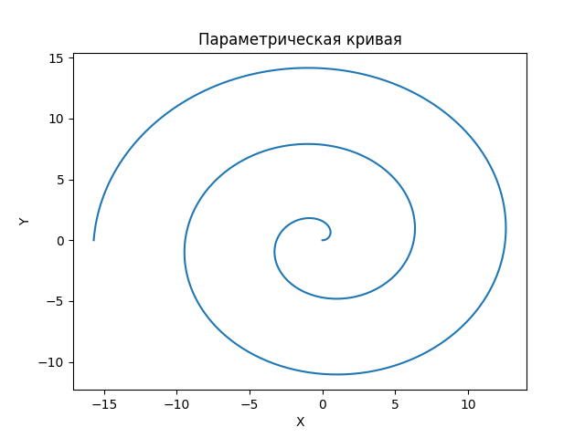
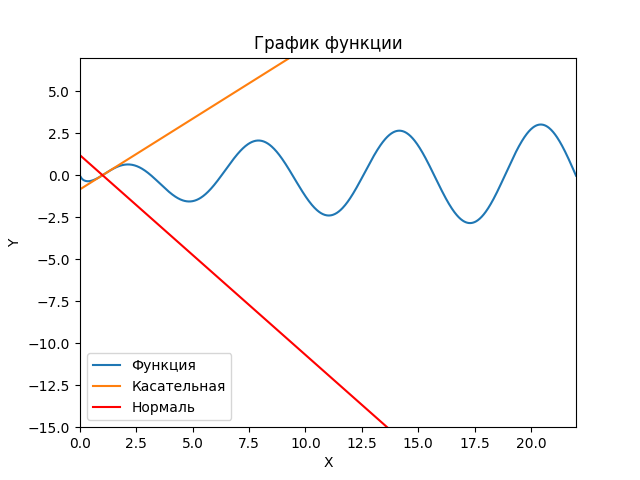

<h2 style="text-align: center;">Бюджетное учреждение высшего образования Ханты-Мансийского автономного округа – Югры</h2>

<h1 style="text-align: center;">«СУРГУТСКИЙ ГОСУДАРСТВЕННЫЙ УНИВЕРСИТЕТ»</h1>

<h2 style="text-align: center;">Политехнический институт</h2>

<p style="text-align: center;">Кафедра прикладной математики</p>

<p style="text-align: center;">Гркикян Мисак Эдикович</p>

<h1 style="text-align: center;">Параметрически заданные кривые.
Производная, дифференциал.</h1>

<p style="text-align: center;">Дисциплина «Математический анализ»</p>

<p style="text-align: center;">направление 01.03.02 «Прикладная математика и информатика»</p>

<p style="text-align: center;">направленность (профиль): «Технологии программирования и анализ данных»</p>

<pre>

</pre>

<p style="text-align: right;">Преподаватель: Ряховский Алексей Васильевич  </p>

<p style="text-align: right;">Доцент</p>

<p style="text-align: right;">Студент гр. № 601-31</p>

<p style="text-align: right;">Гркикян Мисак Эдикович</p>

<pre>

</pre>

<p style="text-align: center;">Сургут 2023 г.</p>

<h3 style="text-align: center;">Лабораторная работа №3. Параметрически заданные кривые.
Производная, дифференциал.</h3>
<h3 style="text-align: center;">Вариант №7</h3>

#### Задание

3.1. Используя графические пакеты Python построить параметрически
заданную кривую.
3.2. Для заданной функции 𝑓(𝑥) аналитически найти уравнения касательной
прямой и нормальной прямой в указанной точке 𝑥0. Используя графические
пакеты Python построить на одном рисунке график функции 𝑓(𝑥),
касательную прямую, нормальную прямую и отметить точку касания.

#### Программное решение 3.1

```python
import numpy as np
import matplotlib.pyplot as plt

t = np.linspace(0, 5*np.pi, 1000)
x = t * np.cos(t)
y = t * np.sin(t)

plt.plot(x, y)
plt.xlabel('X')
plt.ylabel('Y')
plt.title('Параметрическая кривая')
plt.show()
```

#### Иллюстрация решения



<p style="text-align: center;">Рис. 3.1. Иллюстрация решения задачи.</p>

#### Аналитическое решение 3.2

$f(x)=sinxlnx$ , $x_0=1$

Уравнения касательной и нормали к графику функции:

$y=f(x_0)+f'(x_0)(x-x_0)$ - уравнение касательной

$y=f(x_0)-(\frac{1}{f'(x_0)})(x-x_0)$ - уравнение нормали

$f'(x)=cosxlnx+\frac{sinx}{x}$

Уравнения касательной и нормали к графику функции в точке $x_0=1$:

$y=sin(1)ln(1)+(cos(1)ln(1)+\frac{sin(1)}{1})(x-1)=sin(1)(x-1)$ - уравнение касательной в точке $x_0=1$

$y=sin(1)ln(1)-(\frac{1}{cos(1)ln(1)+\frac{sin(1)}{1}})(x-1)=-\frac{1}{sin(1)}(x-1)$ - уравнение нормали в точке $x_0=1$

#### Программное решение 3.2

```python
import numpy as np
import matplotlib.pyplot as plt

def f(x):
    return np.sin(x) * np.log(x)

def tangent_line(x, x0):
    return f(x0) + (np.cos(x0) * np.log(x0) + np.sin(x0) / x0) * (x - x0)

def normal_line(x, x0):
    return f(x0) - (1 / (np.cos(x0) * np.log(x0) + np.sin(x0) / x0)) * (x - x0)

x = np.linspace(0, 22, 1000)
y = f(x)
x0 = 1
y_tangent = tangent_line(x, x0)
y_normal = normal_line(x, x0)

plt.plot(x, y, label='Функция')
plt.plot(x, y_tangent, label='Касательная')
plt.plot(x, y_normal, label='Нормаль', color='red')
plt.xlabel('X')
plt.ylabel('Y')
plt.xlim(0, 22)
plt.ylim(-15, 7)
plt.title('График функции')
plt.legend()
plt.show()
```

#### Иллюстрация решения



<p style="text-align: center;">Рис. 3.2. Иллюстрация решения задачи.</p>
