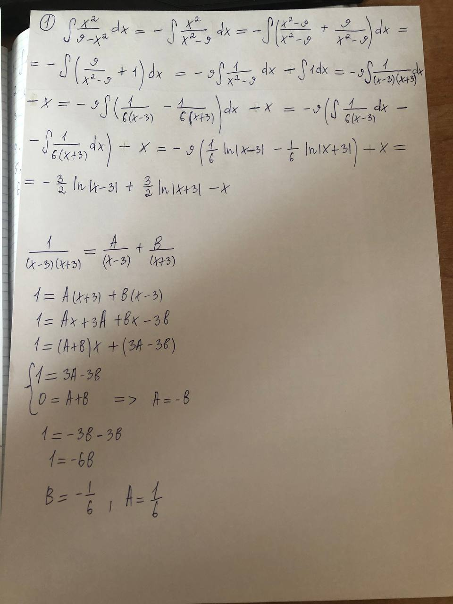
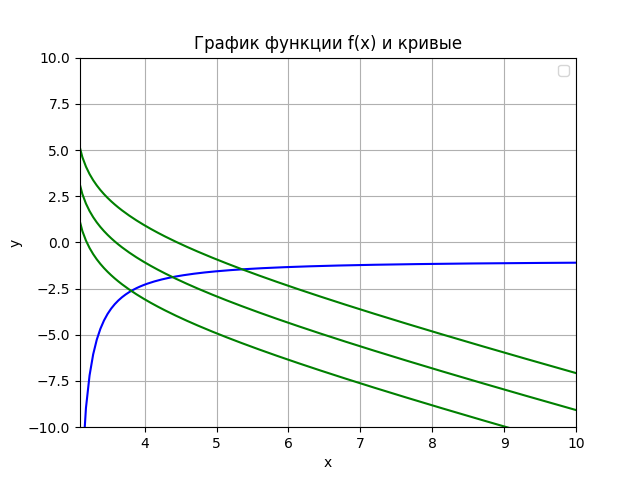
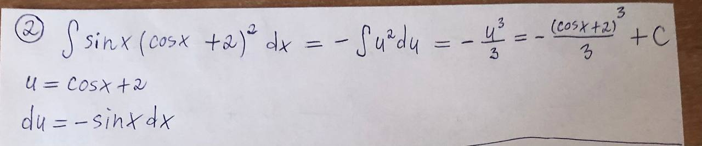
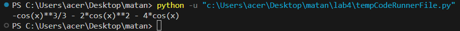
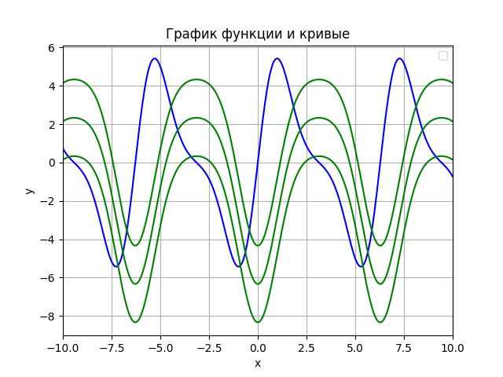
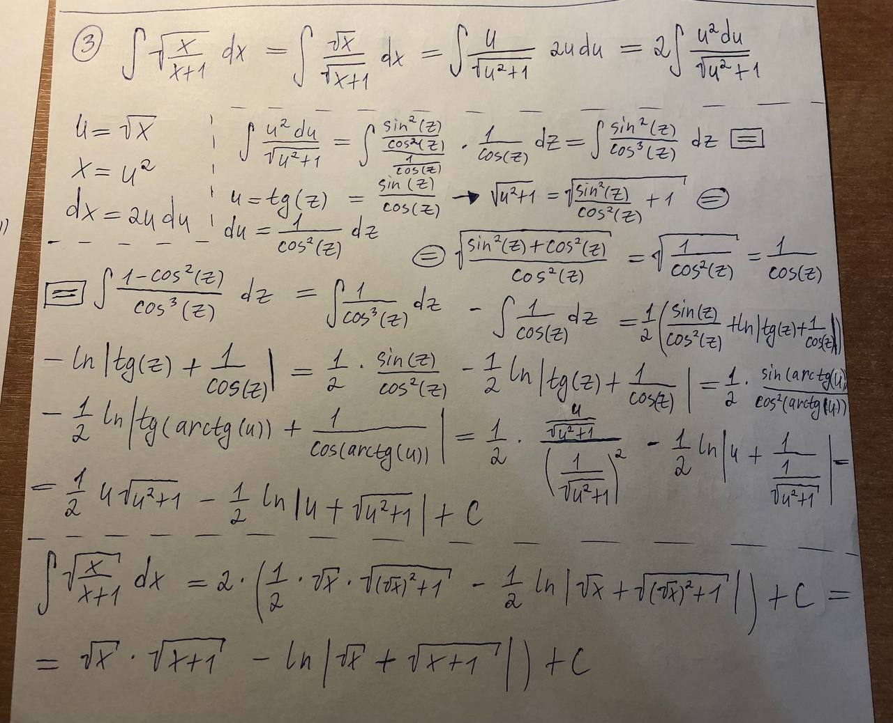
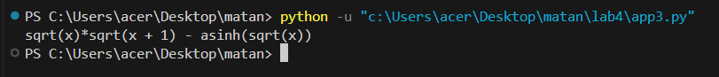
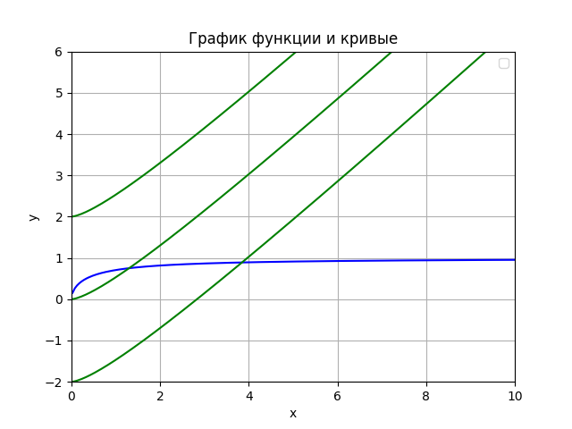

<h2 style="text-align: center;">Бюджетное учреждение высшего образования Ханты-Мансийского автономного округа – Югры</h2>

<h1 style="text-align: center;">«СУРГУТСКИЙ ГОСУДАРСТВЕННЫЙ УНИВЕРСИТЕТ»</h1>

<h2 style="text-align: center;">Политехнический институт</h2>

<p style="text-align: center;">Кафедра прикладной математики</p>

<p style="text-align: center;">Гркикян Мисак Эдикович</p>

<h1 style="text-align: center;">Неопределенный интеграл</h1>

<p style="text-align: center;">Дисциплина «Математический анализ»</p>

<p style="text-align: center;">направление 01.03.02 «Прикладная математика и информатика»</p>

<p style="text-align: center;">направленность (профиль): «Технологии программирования и анализ данных»</p>

<pre>

</pre>

<p style="text-align: right;">Преподаватель: Ряховский Алексей Васильевич  </p>

<p style="text-align: right;">Доцент</p>

<p style="text-align: right;">Студент гр. № 601-31</p>

<p style="text-align: right;">Гркикян Мисак Эдикович</p>

<pre>

</pre>

<p style="text-align: center;">Сургут 2024 г.</p>

<h3 style="text-align: center;">Лабораторная работа №4. Неопределенный интеграл</h3>
<h3 style="text-align: center;">Вариант №6</h3>

#### Задание

4.Вычислить (аналитически и используя библиотеки Python для символьных
вычислений) данные неопределенные интегралы. Для каждого интеграла,
используя графические пакеты Python, на одном рисунке построить: график
подынтегральной функции (синий цвет), и любые три различные
интегральные кривые (зелёный цвет), соответствующие подынтегральной
функции. Графики строить лишь на отрезках, которые целиком лежат в
области определения функций.

#### Аналитическое решение 4.1



#### Программное решение 4.1
```python
import sympy
from sympy.abc import x
f = x**2 / (9-x**2)
print(f.integrate(x))
```

```python
import numpy as np
import matplotlib.pyplot as plt

# Определение функци1
def f(x):
    return x**2 / (9 - x**2)

def f1(x):
    return -x - 3 * np.log(x - 3) / 2 + 3 * np.log(x + 3) / 2 - 2

def f2(x):
    return -x - 3 * np.log(x - 3) / 2 + 3 * np.log(x + 3) / 2 + 2

def f3(x):
    return -x - 3 * np.log(x - 3) / 2 + 3 * np.log(x + 3) / 2

# Создание вектора значений x
x = np.linspace(-10, 10, 400)

# Построение графика и кривых
plt.plot(x, f(x), color='blue')
plt.plot(x, f1(x), color='green')
plt.plot(x, f2(x), color='green')
plt.plot(x, f3(x), color='green')


plt.grid(True)

# Настройка масштаба графика
plt.ylim(-10, 10)
plt.xlim(3.1, 10)

# Настройка внешнего вида графика
plt.xlabel('x')
plt.ylabel('y')
plt.title('График функции f(x) и кривые')
plt.legend()

plt.show()
```

#### Иллюстрация решения




<p style="text-align: center;">Рис. 4.1. Иллюстрация решения задачи.</p>


#### Аналитическое решение 4.2



#### Программное решение 4.2
```python
import sympy
from sympy.abc import x
f = sympy.sin(x) * ((sympy.cos(x) + 2)**2)
print(f.integrate(x))
```

```python
import numpy as np
import matplotlib.pyplot as plt

# Определение функций
def f(x):
    return np.sin(x) * (np.cos(x) + 2)**2

def f1(x):
    return (-np.cos(x)**3)/3 - 2*np.cos(x)**2 - 4*np.cos(x)

def f2(x):
    return (-np.cos(x)**3)/3 - 2*np.cos(x)**2 - 4*np.cos(x) + 2

def f3(x):
    return (-np.cos(x)**3)/3 - 2*np.cos(x)**2 - 4*np.cos(x) - 2

# Создание вектора значений x
x = np.linspace(-10, 10, 400)

# Построение графика
plt.plot(x, f(x), color='blue')
plt.plot(x, f1(x), color='green')
plt.plot(x, f2(x), color='green')
plt.plot(x, f3(x), color='green')


plt.grid(True)

# Настройка масштаба по оси x
plt.xlim(-10, 10)

# Настройка внешнего вида графика
plt.xlabel('x')
plt.ylabel('y')
plt.title('График функции и кривые')
plt.legend()

plt.show()
```

#### Иллюстрация решения





<p style="text-align: center;">Рис. 4.2. Иллюстрация решения задачи.</p>


#### Аналитическое решение 4.3



#### Программное решение 4.3
```python
import sympy
from sympy import sqrt
from sympy.abc import u, x

# Определение функции
f = (2 * u**2) / (sqrt(u**2 + 1))

# Вычисление интеграла
integral = sympy.integrate(f, u)

# Подстановка u = sqrt(x)
integral_x = integral.subs(u, sqrt(x))

print(integral_x)
```

```python
import numpy as np
import math
import matplotlib.pyplot as plt

# Определение функций
def f(x):
    return np.sqrt(x / (x + 1))

def f1(x):
    y = np.sqrt(x) * np.sqrt(x + 1) - np.log(np.sqrt(x) + np.sqrt(x + 1))
    return y

def f2(x):
    y = np.sqrt(x) * np.sqrt(x + 1) - np.log(np.sqrt(x) + np.sqrt(x + 1)) + 2
    return y

def f3(x):
    y = np.sqrt(x) * np.sqrt(x + 1) - np.log(np.sqrt(x) + np.sqrt(x + 1)) - 2 
    return y

# Создание вектора значений x
x = np.linspace(-10, 10, 400)

# Построение графика
plt.plot(x, f(x), color='blue')
plt.plot(x, f1(x), color='green')
plt.plot(x, f2(x), color='green')
plt.plot(x, f3(x), color='green')


plt.grid(True)

# Настройка масштаба по осям x и y
plt.xlim(0, 10)
plt.ylim(-2, 6)  

# Настройка внешнего вида графика
plt.xlabel('x')
plt.ylabel('y')
plt.title('График функции и кривые')
plt.legend()

plt.show()
```

#### Иллюстрация решения





<p style="text-align: center;">Рис. 4.3. Иллюстрация решения задачи.</p>
