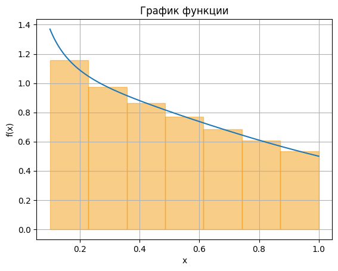

<h2 style="text-align: center;">Бюджетное учреждение высшего образования Ханты-Мансийского автономного округа – Югры</h2>

<h1 style="text-align: center;">«СУРГУТСКИЙ ГОСУДАРСТВЕННЫЙ УНИВЕРСИТЕТ»</h1>

<h2 style="text-align: center;">Политехнический институт</h2>

<p style="text-align: center;">Кафедра прикладной математики</p>

<p style="text-align: center;">Гркикян Мисак Эдикович</p>

<h1 style="text-align: center;">Определенный интеграл</h1>

<p style="text-align: center;">Дисциплина «Математический анализ»</p>

<p style="text-align: center;">направление 01.03.02 «Прикладная математика и информатика»</p>

<p style="text-align: center;">направленность (профиль): «Технологии программирования и анализ данных»</p>

<pre>

</pre>

<p style="text-align: right;">Преподаватель: Ряховский Алексей Васильевич  </p>

<p style="text-align: right;">Доцент</p>

<p style="text-align: right;">Студент гр. № 601-31</p>

<p style="text-align: right;">Гркикян Мисак Эдикович</p>

<pre>

</pre>

<p style="text-align: center;">Сургут 2024 г.</p>

<h3 style="text-align: center;">Лабораторная работа №5. Определенный интеграл</h3>
<h3 style="text-align: center;">Вариант №6</h3>

#### Задание
5. Для указанного определенного интеграла
∫ 𝑓(𝑥)𝑑𝑥
𝑏
𝑎
выполнить следующие задания:
1) Аналитически найти значение интеграла.
2) Найти значение интеграла при помощи функций для символьных
вычислений из модуля sympy.
3) Написать программу, которая вычисляет интегральную сумму
𝜎 = ∑𝑓(𝑥̅𝑘
)∆𝑥𝑘
𝑛
𝑘=1
Для вычисления интегральной суммы 𝜎 выбрать равномерное разбиение
отрезка [𝑎, 𝑏] на 𝑛 = 7 равных отрезков. В качестве точек 𝑥̅𝑘 выбрать
середины отрезков разбиения.
4) Написать программу, которая на одном рисунке изображает график
функции 𝑓(𝑥) на отрезке [𝑎, 𝑏], а также 𝑛 прямоугольников, построенных на
отрезках разбиения. Каждый прямоугольник имеет высоту |𝑓(𝑥̅𝑘
)| и ширину
∆𝑥𝑘, 𝑘 = 1, … , 𝑛. Прямоугольник строится вверх, если 𝑓(𝑥̅𝑘
) положительно, и
строится вниз в противном случае

#### Аналитическое решение 5


#### Программное решение 5
```python
import sympy
from sympy.abc import x
import numpy as np
f = 1 / (x ** 2 + 2)
integral = sympy.integrate(f, (x, 0, 1))
num_val = integral.evalf()
print(integral)
print(f"Приближенное значение: {num_val}")

# Интегральная сумма
def f(x):
    return 1/(x**2 + 2)  

import numpy as np

def f(x):
    return 1/(x**2 + 2)

a = 0
b = 1
n = 7

dx = (b - a) / n
x_points = [a + dx * (k + 0.5) for k in range(n)]

sigma = sum(f(x) * dx for x in x_points)
print(f"Интегральная сумма: {sigma}")
```

График функции:
```python
import numpy as np
import matplotlib.pyplot as plt

def f(x):
    return 1 / (x * (np.log(x) ** 2 + 2))

# Границы интегрирования и количество разбиений
a = 0.1
b = 1
n = 7

x_vals = np.linspace(a, b, 400)
y_vals = f(x_vals)

# Шаг разбиения
dx = (b - a) / n

plt.plot(x_vals, y_vals)  # Добавляем график функции
plt.title('График функции')
plt.xlabel('x')
plt.ylabel('f(x)')
plt.grid()

for k in range(1, n+1):
    x_k = a + (k - 0.5) * dx
    f_x_k = f(x_k)
    color = 'blue' if f_x_k < 0 else '#F39C12'
    rect = plt.Rectangle((x_k - dx/2, 0), dx, f_x_k, color=color, alpha=0.5)
    plt.gca().add_patch(rect)

plt.show()  # Отображаем график с прямоугольниками
```

#### Иллюстрация решения




<p style="text-align: center;">Рис. 5. Иллюстрация решения задачи.</p>


