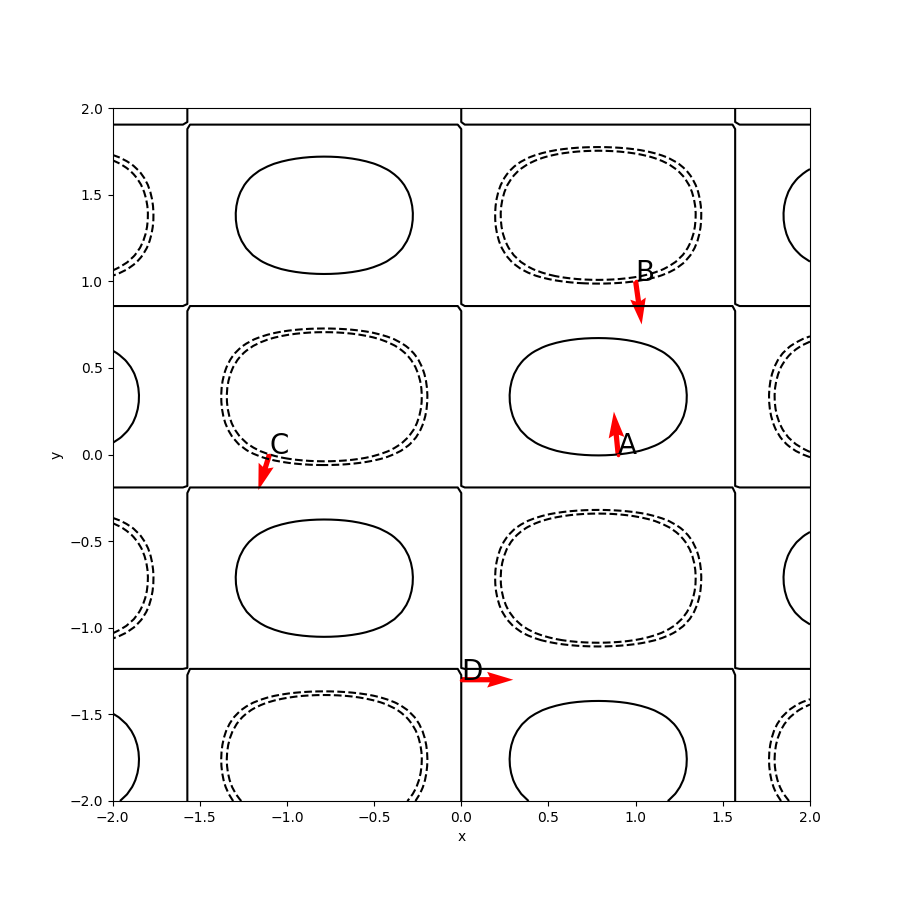

<h2 style="text-align: center;">Бюджетное учреждение высшего образования Ханты-Мансийского автономного округа – Югры</h2>

<h1 style="text-align: center;">«СУРГУТСКИЙ ГОСУДАРСТВЕННЫЙ УНИВЕРСИТЕТ»</h1>

<h2 style="text-align: center;">Политехнический институт</h2>

<p style="text-align: center;">Кафедра прикладной математики</p>

<p style="text-align: center;">Гркикян Мисак Эдикович</p>

<h1 style="text-align: center;">Линии уровня и градиент</h1>

<p style="text-align: center;">Дисциплина «Математический анализ»</p>

<p style="text-align: center;">направление 01.03.02 «Прикладная математика и информатика»</p>

<p style="text-align: center;">направленность (профиль): «Технологии программирования и анализ данных»</p>

<pre>

</pre>

<p style="text-align: right;">Преподаватель: Ряховский Алексей Васильевич  </p>

<p style="text-align: right;">Доцент</p>

<p style="text-align: right;">Студент гр. № 601-31</p>

<p style="text-align: right;">Гркикян Мисак Эдикович</p>

<pre>

</pre>

<p style="text-align: center;">Сургут 2024 г.</p>

<h3 style="text-align: center;">Лабораторная работа №6. Линии уровня и градиент.</h3>
<h3 style="text-align: center;">Вариант №6</h3>


#### Задание
6. Для заданной функции $𝑧 = 𝑓(𝑥, 𝑦)$ в квадрате [−2, 2] × [−2,2] построить 
линии уровня, проходящие через точки 𝐴 = (0.9, 0), 𝐵 = (1, 1), 𝐶 = (−1.1, 0), 
𝐷 = (0, −1.3). В каждой из точек 𝐴, 𝐵, 𝐶 и 𝐷 изобразить вектор, 
сонаправленный вектору градиента $∇𝑓(𝑥, 𝑦)$ в соответствующей точке. Длину 
этих векторов можно выбрать произвольной, из соображений наглядности 
рисунка. На рисунке также должны быть подписаны координатные оси, а 
также все точки 𝐴, 𝐵, 𝐶 и 𝐷.
Учесть случаи, когда линии уровня совпадают или когда линия уровня 
вырождается в точку.
Также в отчете привести все вычисления, связанные с вычислением 
частных производных $𝑓_𝑥'$ и $𝑓_𝑦'$
 функции $𝑓(𝑥, 𝑦)$ в точках 𝐴, 𝐵, 𝐶 и 𝐷.

---

#### Аналитическое решение
##### Вычисление частных производных функции

Для функции $f(x, y) = \sin(2x) \cdot \cos(3y - 1)$ частные производные вычисляются следующим образом:

$f_x'(x, y) = 2 \cdot \cos(2x) \cdot \cos(3y - 1)$

$f_y'(x, y) = -3 \cdot \sin(2x) \cdot \sin(3y - 1)$

---

Для точки 𝐴 = (0.9, 0):

$f_x'(0.9, 0) = 2 \cdot \cos(1.8) \cdot \cos(-1) = -0,245516$

$f_y'(0.9, 0) = -3 \cdot \sin(1.8) \cdot \sin(-1) = 2,45839$

---

Для точки 𝐵 = (1, 1):

$f_x'(1, 1) = 2 \cdot \cos(2) \cdot \cos(2) = 0,346356$

$f_y'(1, 1) = -3 \cdot \sin(2) \cdot \sin(2) = -2,48047$

---

Для точки 𝐶 = (-1.1, 0):

$f_x'(-1.1, 0) = 2 \cdot \cos(-2.2) \cdot \cos(-1) = -0,635937$

$f_y'(-1.1, 0) = -3 \cdot \sin(-2.2) \cdot \sin(-1) = -2,04098$

---

Для точки 𝐷 = (0, -1.3):

$f_x'(0, -1.3) = 2 \cdot \cos(0) \cdot \cos(-4.9) = 0,373025$

$f_y'(0, -1.3) = -3 \cdot \sin(0) \cdot \sin(-4.9) = 0$

---

#### Программное решение

```python
import numpy as np
import matplotlib.pyplot as plt

def f(x, y):
    return np.sin(2*x) * np.cos(3*y - 1)

# Создание сетки
x = np.linspace(-2, 2, 100)
y = np.linspace(-2, 2, 100)
X, Y = np.meshgrid(x, y)

# Вычисление частных производных в заданных точках
A = (0.9, 0)
B = (1, 1)
C = (-1.1, 0)
D = (0, -1.3)

f_x_A = 2*np.cos(2*A[0])*np.cos(3*A[1] - 1)
f_y_A = -3*np.sin(2*A[0])*np.sin(3*A[1] - 1)

f_x_B = 2*np.cos(2*B[0])*np.cos(3*B[1] - 1)
f_y_B = -3*np.sin(2*B[0])*np.sin(3*B[1] - 1)

f_x_C = 2*np.cos(2*C[0])*np.cos(3*C[1] - 1)
f_y_C = -3*np.sin(2*C[0])*np.sin(3*C[1] - 1)

f_x_D = 2*np.cos(2*D[0])*np.cos(3*D[1] - 1)
f_y_D = -3*np.sin(2*D[0])*np.sin(3*D[1] - 1)

# Построение графика
plt.figure(figsize=(9, 9))
levels = sorted([f(A[0], A[1]), f(B[0], B[1]), f(C[0], C[1]), f(D[0], D[1])])
plt.contour(X, Y, f(X, Y), levels=levels, colors='k')
plt.quiver(A[0], A[1], f_x_A, f_y_A, color='r', scale=40)
plt.quiver(B[0], B[1], f_x_B, f_y_B, color='r', scale=40)
plt.quiver(C[0], C[1], f_x_C, f_y_C, color='r', scale=40)
plt.quiver(D[0], D[1], f_x_D, f_y_D, color='r', scale=40)
plt.plot(A[0], A[1], 'ro', markersize=1.5, linewidth=1)
plt.plot(B[0], B[1], 'ro', markersize=1.5, linewidth=1)
plt.plot(C[0], C[1], 'ro', markersize=1.5, linewidth=1)
plt.plot(D[0], D[1], 'ro', markersize=1.5, linewidth=1)
plt.text(A[0], A[1], 'A', fontsize=20)
plt.text(B[0], B[1], 'B', fontsize=20)
plt.text(C[0], C[1], 'C', fontsize=20)
plt.text(D[0], D[1], 'D', fontsize=20)
plt.xlabel('x')
plt.ylabel('y')
plt.show()
```

#### Иллюстрация решения



<p style="text-align: center;">Рис. 1. Иллюстрация решения задачи.</p>


