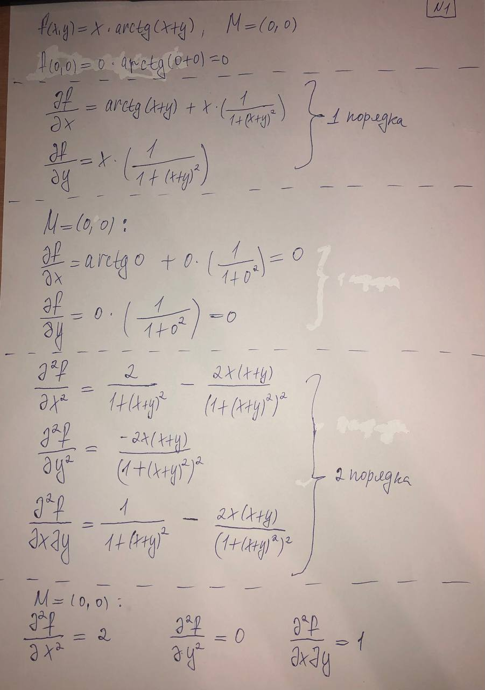
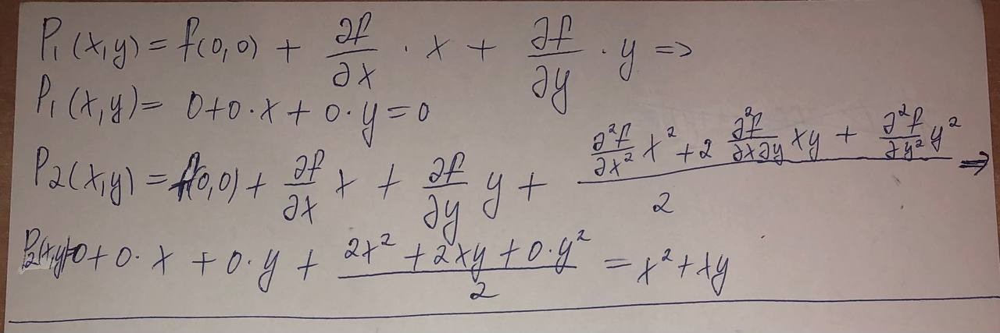
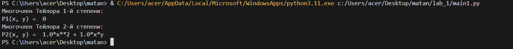
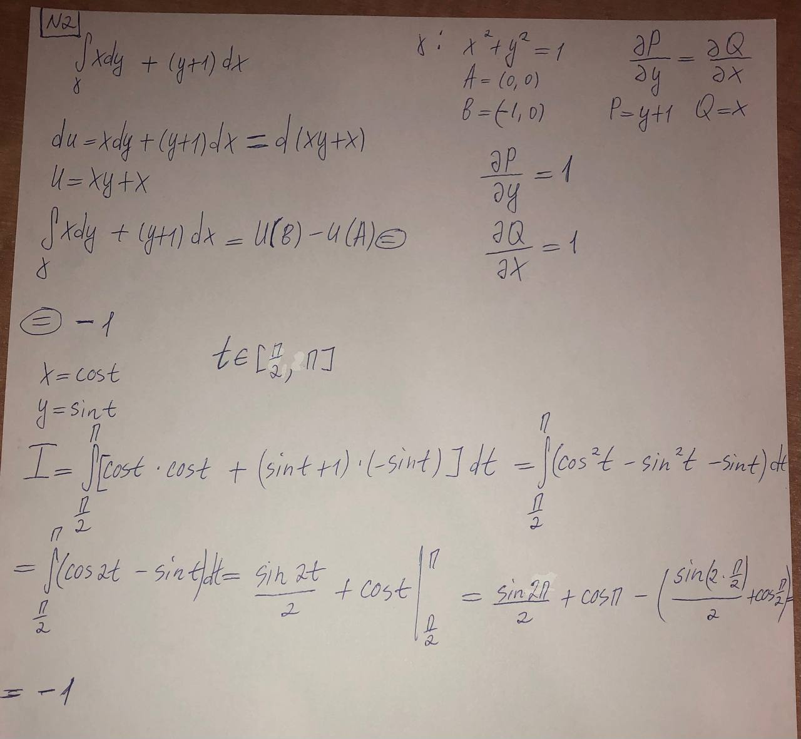
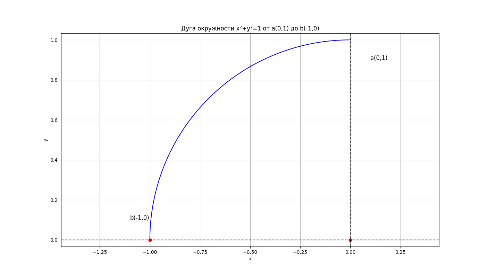
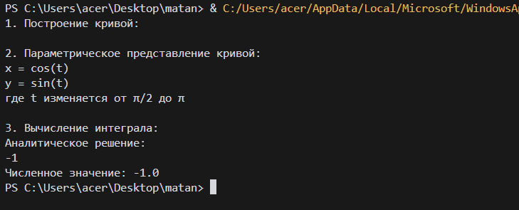

<h2 style="text-align: center;">Бюджетное учреждение высшего образования Ханты-Мансийского автономного округа – Югры</h2>

<h1 style="text-align: center;">«СУРГУТСКИЙ ГОСУДАРСТВЕННЫЙ УНИВЕРСИТЕТ»</h1>

<h2 style="text-align: center;">Политехнический институт</h2>

<p style="text-align: center;">Кафедра прикладной математики</p>

<p style="text-align: center;">Гркикян Мисак Эдикович</p>

<h1 style="text-align: center;">Формула Тейлора. Криволинейные интегралы.</h1>

<p style="text-align: center;">Дисциплина «Математический анализ»</p>

<p style="text-align: center;">направление 01.03.02 «Прикладная математика и информатика»</p>

<p style="text-align: center;">направленность (профиль): «Технологии программирования и анализ данных»</p>

<pre>

</pre>

<p style="text-align: right;">Преподаватель: Ряховский Алексей Васильевич  </p>

<p style="text-align: right;">Доцент</p>

<p style="text-align: right;">Студент гр. № 601-31</p>

<p style="text-align: right;">Гркикян Мисак Эдикович</p>

<pre>

</pre>

<p style="text-align: center;">Сургут 2024 г.</p>

<h3 style="text-align: center;">Лабораторная работа №7. Формула Тейлора. Криволинейные интегралы.</h3>
<h3 style="text-align: center;">Вариант №7</h3>

#### Задание 1
Аналитически и средствами Python найти многочлен Тейлора 2-й
степени в точке $M$ для заданной функции $f(x,y)$ :

#### Аналитическое решение 1



#### Программное решение 1
```python
from sympy import symbols, diff, atan, expand

# Определение символьных переменных
x, y = symbols("x y")

# Определение функции
f = x * atan(x + y)

# Вычисление частных производных первого порядка
df_dx = diff(f, x)  # частная производная по x
df_dy = diff(f, y)  # частная производная по y

# Вычисление частных производных второго порядка
d2f_dx2 = diff(df_dx, x)  # вторая производная по x
d2f_dy2 = diff(df_dy, y)  # вторая производная по y
d2f_dxdy = diff(df_dx, y)  # смешанная производная

# Точка m=(0,0)
args = [(x, 0), (y, 0)]  # аргументы для подстановки, x = 0, y = 0

# Вычисление первого дифференциала
df = df_dx.subs(args)*x + df_dy.subs(args)*y

# Вычисление второго дифференциала
d2f = (1/2) * (d2f_dx2.subs(args)*x**2 + 2*d2f_dxdy.subs(args)*x*y + d2f_dy2.subs(args)*y**2)

# Вычисление многочлена Тейлора 2-й степени
Taylor_polynomial_2 = expand(f.subs(args) + df + d2f)

# Вывод результатов
print("Многочлен Тейлора 1-й степени:")
print("P1(x, y) = ", expand(f.subs(args) + df))
print("Многочлен Тейлора 2-й степени:")
print("P2(x, y) = ", Taylor_polynomial_2)
```



<p style="text-align: center;">Рис. 1. Вывод программы в терминале.</p>

#### Задание 2
1) Средствами Python изобразить кривую $γ$ , по которой производится
интегрирование. На рисунке подписать координатные оси и точки, указанные
в задании.
2) Ввести параметрическое представление кривой, приведя все необходимые
вычисления.
3) Свести криволинейный интеграл 2-го рода к обычному определенному
интегралу и вычислить его аналитически и средствами Python.
4) Проверить зависит ли интеграл от пути интегрирования и, если нет, то
найти функцию $u(x,y)$, для которой подынтегральное выражение является
полным дифференциалом, и вычислить интеграл с ее помощью (только
аналитически). 

#### Аналитическое решение 2


#### Программное решение 2
```python
import sympy as sp
import matplotlib.pyplot as plt
import numpy as np

def plot_curve():
    theta = np.linspace(np.pi/2, np.pi, 100)
    x = np.cos(theta)
    y = np.sin(theta)

    plt.figure(figsize=(8, 8))
    plt.plot(x, y, 'b-')
    plt.plot([0, -1], [0, 0], 'ro')
    plt.text(0.1, 0.9, 'a(0,1)', fontsize=12)
    plt.text(-1.1, 0.1, 'b(-1,0)', fontsize=12)
    plt.axhline(y=0, color='k', linestyle='--')
    plt.axvline(x=0, color='k', linestyle='--')
    plt.xlabel('x')
    plt.ylabel('y')
    plt.title('Дуга окружности x²+y²=1 от a(0,1) до b(-1,0)')
    plt.grid(True)
    plt.axis('equal')
    plt.show()

def calculate_integral():
    t = sp.Symbol('t')
    x = sp.cos(t)
    y = sp.sin(t)
    dx = sp.diff(x, t)
    dy = sp.diff(y, t)

    integrand = x * dy + (y + 1) * dx
    integral = sp.integrate(integrand, (t, sp.pi/2, sp.pi))

    print("Аналитическое решение:")
    print(integral)
    print(f"Численное значение: {float(integral)}")


if __name__ == "__main__":
    print("1. Построение кривой:")
    plot_curve()
    
    print("\n2. Параметрическое представление кривой:")
    print("x = cos(t)")
    print("y = sin(t)")
    print("где t изменяется от π/2 до π")
    
    print("\n3. Вычисление интеграла:")
    calculate_integral()
```



<p style="text-align: center;">Рис. 2. Вывод программы в терминале.</p>



<p style="text-align: center;">Рис. 3. Вывод программы в терминале.</p>